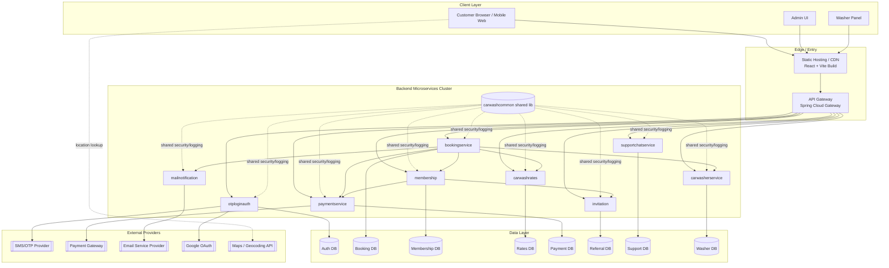

# ASP Care Deployment View

## How to Read
- **Client layer**: Browsers/panels access the app UI build, then API requests go to gateway.
- **Edge layer**: CDN/static hosting serves frontend assets; API Gateway handles backend entry and service routing.
- **Service cluster**: Backend microservices are independently deployable units with clear domain boundaries.
- **Data layer**: Each service has a dedicated logical datastore, reducing cross-service coupling.
- **External providers**: OTP, payment, email, OAuth, and maps are third-party integrations.
- **Shared library**: `carwashcommon` is not a standalone runtime service; it is a shared dependency used by services.
- **Critical path**: Booking and membership flows depend on rates/payment and trigger mail notifications.

## Transaction Correlation Standard
- Use request header `X-Transaction-Id` end-to-end across gateway and all microservices.
- Frontend already sends this header globally for every API call.
- Backend implementation details are documented in [BACKEND_TRANSACTION_ID_IMPLEMENTATION.md](BACKEND_TRANSACTION_ID_IMPLEMENTATION.md).
