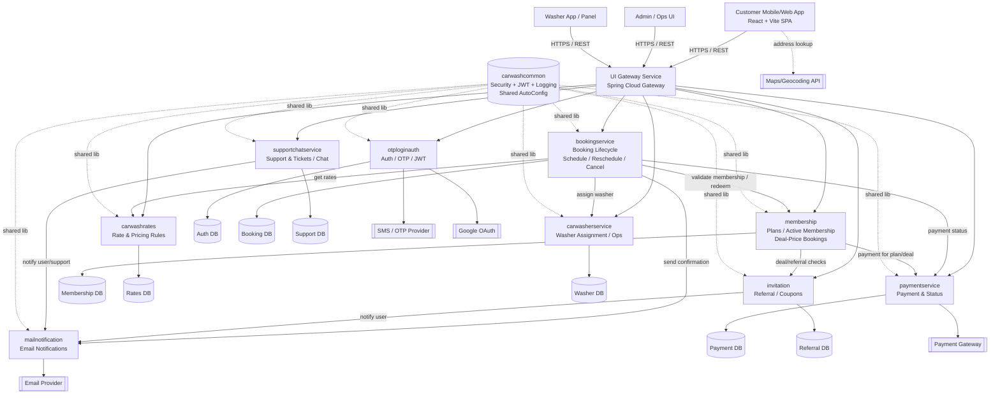

# ASP Care Architecture Diagram

## How to view
- Open this file in VS Code
- Press `Ctrl+Shift+V` to open Markdown preview

## How to Read
- **Clients**: Customer, admin, and washer interfaces call backend APIs through the gateway.
- **Gateway**: `UI Gateway Service` is the single backend entry point and routes requests to microservices.
- **Core services**: Each service owns one domain area (auth, booking, membership, rates, payment, referrals, support, washer ops, notifications).
- **Service flow**: `bookingservice` orchestrates most runtime calls to rates, membership, payment, washer assignment, and notifications.
- **Data ownership**: Each service maps to its own logical database for better separation of concerns.
- **Shared module**: `carwashcommon` provides cross-cutting capabilities (JWT/security/logging) reused by multiple services.
- **External systems**: OTP/SMS, payment gateway, email, maps, and Google OAuth are outside your platform boundary.
