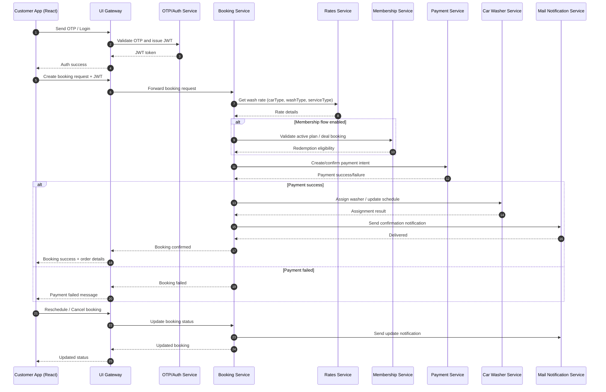

# ASP Care Request Flow (Sequence)

## How to Read
- **Actors**: The customer app talks only to gateway; gateway forwards to backend services.
- **Auth stage**: Login/OTP returns JWT used for subsequent booking operations.
- **Booking orchestration**: Booking service coordinates rates, membership validation, payment, washer assignment, and notifications.
- **Conditional branches**: `alt` blocks show success/failure behavior paths.
- **Lifecycle updates**: Reschedule/cancel flows still pass through booking service and notify users.
